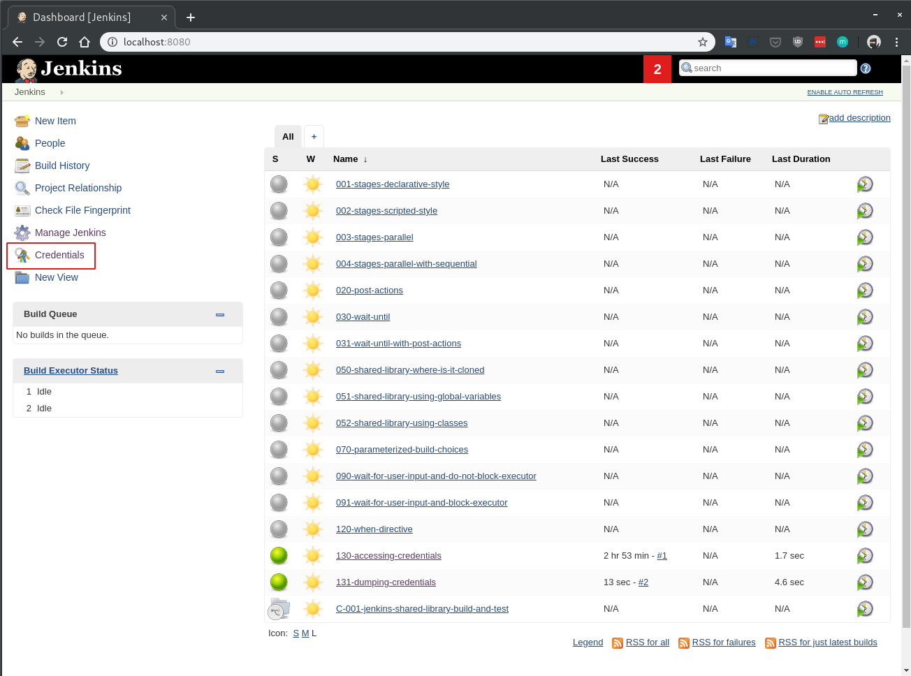
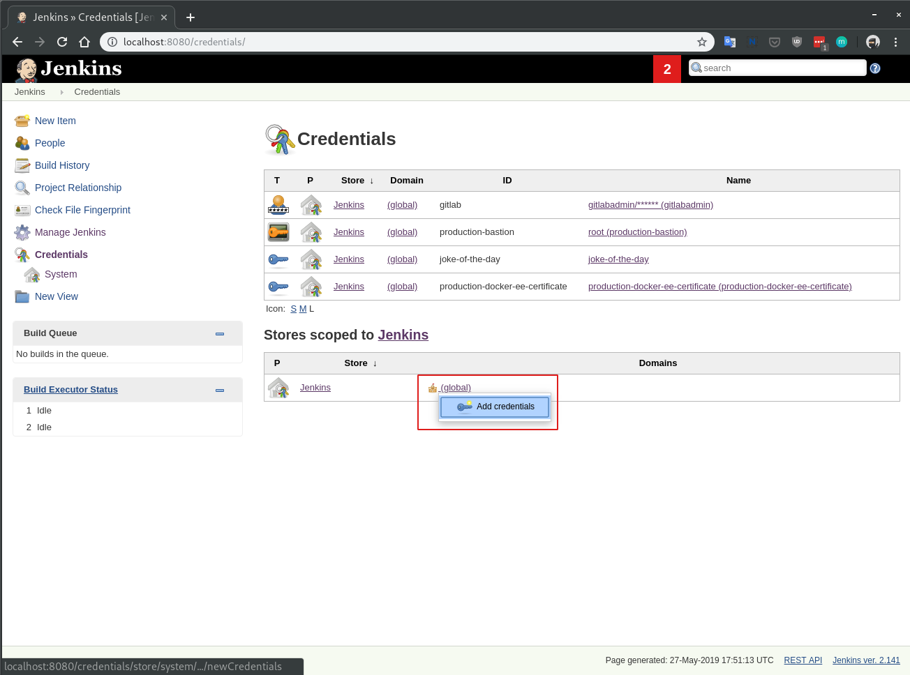
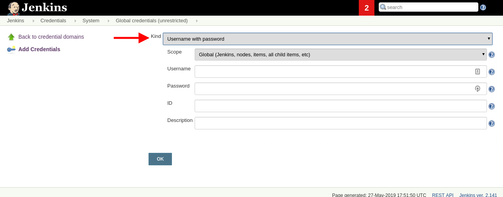
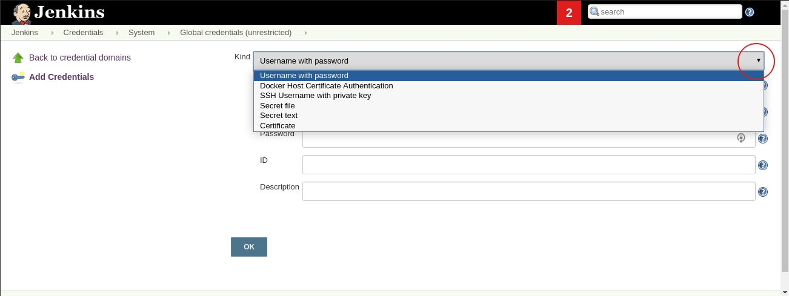
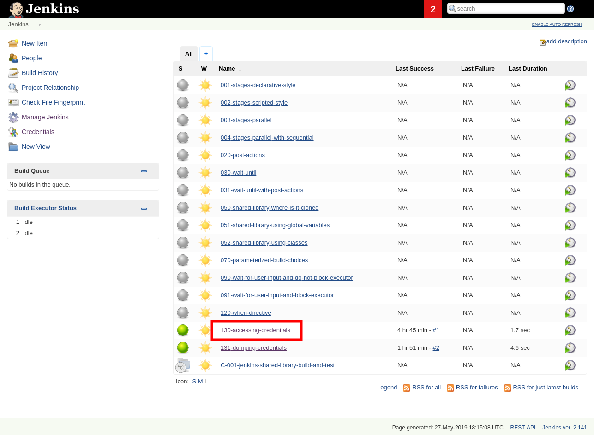
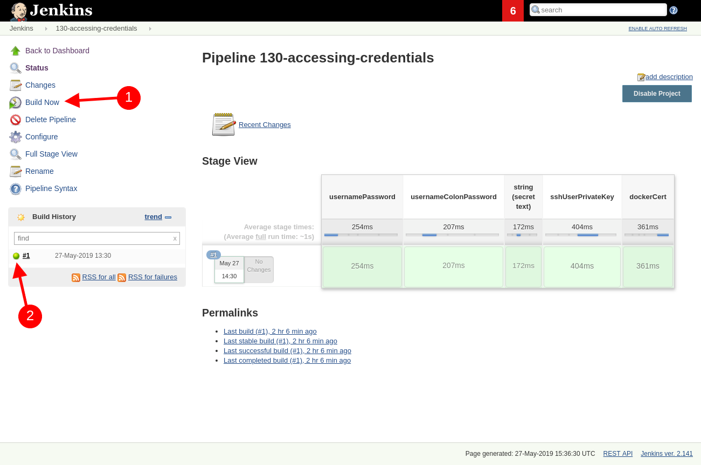
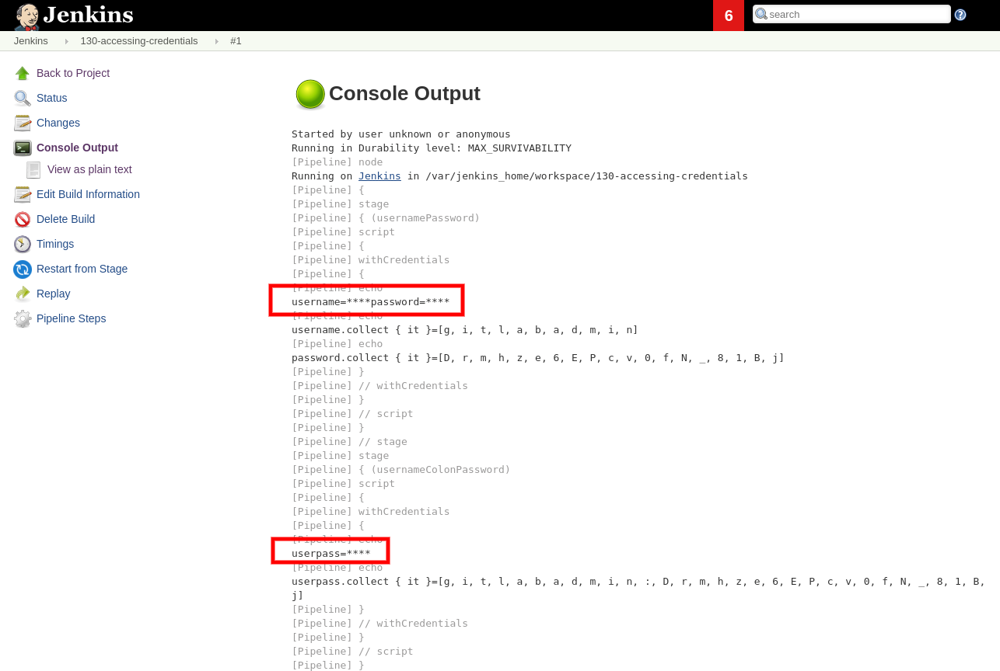

# Accessing and dumping Jenkins credentials

Creating, accessing and dumping Jenkins credentials.


*Photo by [Stefan Steinbauer](https://unsplash.com/photos/HK8IoD-5zpg?utm_source=unsplash&utm_medium=referral&utm_content=creditCopyText) on Unsplash*

Most pipelines requires secrets to authenticate with some external resources.  
All secrets should live outside of our code repository and should be fed directly into the pipeline.   
Jenkins offers a credentials store where we can keep our secrets and access them from jobs.

## Why

> Jenkins is an easy pick when it comes to intelligence gathering.

To provide the best service as consultants we need all the information the client can give us.
Sometimes the things we need to check are temporarily out of our reach.  
We of course request permission to gain access but it can take quite awhile, and time may be of the essence.

> To make a good first impression ask Jenkins for a confession.

We could be delayed by questions like "why do you need that?" or "I will have to talk with my supervisor first".  
There is no need for that, we already have the approval. 
We are the Consultants.  

> The answers you seek, Jenkins shall leak.

Sometimes there are entities which are reluctant to share.
Could be job safety, could be an attempt to hide those customers password stored in production DB using base64.
We don't judge, stuff happens, we understand.  
We just need to know.

> We don't know them, they don't know us, Jenkins but doesn't choose sides.


If you are not a consultant then how about this scenario:
What do you do when you join a project and the person with the key knowledge has long left and nobody knows how the access that windows 98 machine in production.  
Jenkins knows.  
Now you know.  
Be the hero.

> Encryption, decryption, Jenkins provides plain text subscription.

## Credentials storage

I did not use the word "secure" anywhere in the introduction because the way any CI server stores credentials is by nature insecure.

CI servers cannot use one-way hashes (like bcrypt) to encode secrets because when requested by the pipeline those secrets needs to be restored back into their original form.  
One-way hashes are then out of the picture, what's left is two-way encryption.  
This means two things:
1. Anyone with "Create jobs" permissions can view secrets in plain form.
2. Jenkins encrypts secrets at rest but keeps the decryption key somewhere on its host.

You may be wondering why Jenkins even bother encrypting the secrets if they can be retrieved just by asking.
The only reasonable idea that comes to my mind is that Jenkins creators wanted to make it a little bit harder to gain access to plain format secrets when the attacker gains ssh access to the Jenkins host.

However, using credentials store is infinitely better then keeping secrets in the project repository.  
Later in this post I will talk about what can be done to minimize the secrets leakage from Jenkins.

## Creating credentials

If you want to follow this post and run the examples yourself, you can spin up a pre-made Jenkins instance from my [jenkinsfile-examples][0] repository in less then 1min (depending on your bandwidth):

```bash
git clone https://github.com/hoto/jenkinsfile-examples.git
docker-compose pull
docker-compose up
```

Open `localhost:8080` where you should see a Jenkins with a couple of jobs.

To browse and add secrets click on `Credentials`.  
My Jenkins instance already have some pre-made credentials.



To add secrets hover over `(global)` to show a ▼ sign and click on it.  
Select `Add credentials` where you can finally add secrets.



If you want you can add more secrets, but I will be using the already pre-made secrets.





Now that we've covered creating credentials let's move on to accessing them from a `Jenkinsfile`.

## Secrets access from a Jenkinsfile

We will be focusing on job `130-accessing-credentials`. 



Job `130-accessing-credentials` has a following [Jenkinsfile][1]:

```groovy
pipeline {
  agent any
  stages {

    stage('usernamePassword') {
      steps {
        script {
          withCredentials([
            usernamePassword(credentialsId: 'gitlab',
              usernameVariable: 'username',
              passwordVariable: 'password')
          ]) {
            print 'username=' + username + 'password=' + password

            print 'username.collect { it }=' + username.collect { it }
            print 'password.collect { it }=' + password.collect { it }
          }
        }
      }
    }

    stage('usernameColonPassword') {
      steps {
        script {
          withCredentials([
            usernameColonPassword(
              credentialsId: 'gitlab',
              variable: 'userpass')
          ]) {
            print 'userpass=' + userpass
            print 'userpass.collect { it }=' + userpass.collect { it }
          }
        }
      }
    }

    stage('string (secret text)') {
      steps {
        script {
          withCredentials([
            string(
              credentialsId: 'joke-of-the-day',
              variable: 'joke')
          ]) {
            print 'joke=' + joke
            print 'joke.collect { it }=' + joke.collect { it }
          }
        }
      }
    }

    stage('sshUserPrivateKey') {
      steps {
        script {
          withCredentials([
            sshUserPrivateKey(
              credentialsId: 'production-bastion',
              keyFileVariable: 'keyFile',
              passphraseVariable: 'passphrase',
              usernameVariable: 'username')
          ]) {
            print 'keyFile=' + keyFile
            print 'passphrase=' + passphrase
            print 'username=' + username
            print 'keyFile.collect { it }=' + keyFile.collect { it }
            print 'passphrase.collect { it }=' + passphrase.collect { it }
            print 'username.collect { it }=' + username.collect { it }
            print 'keyFileContent=' + readFile(keyFile)
          }
        }
      }
    }

    stage('dockerCert') {
      steps {
        script {
          withCredentials([
            dockerCert(
              credentialsId: 'production-docker-ee-certificate',
              variable: 'DOCKER_CERT_PATH')
          ]) {
            print 'DOCKER_CERT_PATH=' + DOCKER_CERT_PATH
            print 'DOCKER_CERT_PATH.collect { it }=' + DOCKER_CERT_PATH.collect { it }
            print 'DOCKER_CERT_PATH/ca.pem=' + readFile("$DOCKER_CERT_PATH/ca.pem")
            print 'DOCKER_CERT_PATH/cert.pem=' + readFile("$DOCKER_CERT_PATH/cert.pem")
            print 'DOCKER_CERT_PATH/key.pem=' + readFile("$DOCKER_CERT_PATH/key.pem")
          }
        }
      }
    }

    stage('list credentials ids') {
      steps {
        script {
          sh 'cat $JENKINS_HOME/credentials.xml | grep "<id>"'
        }
      }
    }

  }
}
```

All examples for different types of secrets can be found in the official Jenkins [documentation][2]



Running the job and checking the logs uncovers that Jenkins tries to redact the secrets from the build log by matching for secrets values and replacing them with stars `****`.  
We can see the actual secret values if we print them in such a way that a simple match and replace won't work.  

Code:
```groovy
print 'username.collect { it }=' + username.collect { it }
```
Log output:
```
username.collect { it }=[g, i, t, l, a, b, a, d, m, i, n]
```

In this case each character is printed separately and Jenkins does not redact the values.



> Anyone with write access to a repository built on Jenkins can uncover all `Global` credentials by modifying a `Jenkinsfile`.

> Anyone with "create job" privileges can uncover all `Global` secrets by creating a pipeline job.

### Listing ids of secrets

You can list all credentials ids by listing the `$JENKINS_HOME/credentials.xml` file.

Code:
```groovy
stage('list credentials ids') {
  steps {
    script {
      sh 'cat $JENKINS_HOME/credentials.xml | grep "<id>"'
    }
  }
}
```
Log output:
``` 
+ cat /var/jenkins_home/credentials.xml
+ grep <id>
          <id>gitlab</id>
          <id>production-bastion</id>
          <id>joke-of-the-day</id>
          <id>production-docker-ee-certificate</id>
```

## Accessing `System` and other credential values 

Jenkins has two types of credentials: `System` and `Global`.

`System` are accessible only from Jenkins configuration (e.g. plugins).

`Global` same as System but also accessible from jobs.  


Although most credentials are stored in `http://localhost:8080/credentials/` view, you can find additional secrets at:
1. `http://localhost:8080/configure` - some plugins create password type fields there.
2. `http://localhost:8080/configureSecurity/` - look for AD credentials.

By definition `System` credentials are not accessible from jobs but we can decrypt them from the Jenkins GUI, given we have admin permissions.
Jenkins sends the encrypted value of each secret to the UI.  
This is a big security flow and I do not know why 

To decrypt any credentials we can use Jenkins console which requires admin privilidges to access.  
If you don't have admin privilidges, try to elevate your permissions by looking for an admin user in `Global` credentials and log as admin first.

Navigate to `http://localhost:8080/script` which opens the `Script Console`.  

Tell jenkins to decrypt and print out the secret:

```groovy
println hudson.util.Secret.decrypt("<encoded_secret>")
```

Side note: if you try to run this code from a job (Jenkinsfile) you will get an error message:

```
Scripts not permitted to use staticMethod hudson.util.Secret decrypt java.lang.String. Administrators can decide whether to approve or reject this signature.
```


## How Jenkins stores credentials

## Decrypting and dumping credentials

## Prevention and best practices

[0]: https://github.com/hoto/jenkinsfile-examples
[1]: https://github.com/hoto/jenkinsfile-examples/blob/master/jenkinsfiles/130-credentials-masking.groovy 
[2]: https://jenkins.io/doc/pipeline/steps/credentials-binding/